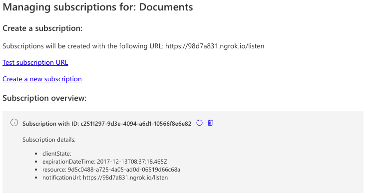
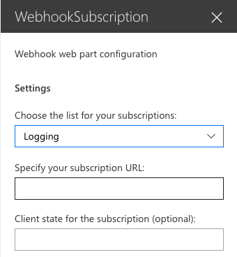
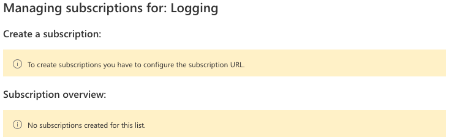

# SharePoint Framework web part to manage Webhooks

This is a web part created for one of my sessions about SharePoint Webhooks. The web part can be used to create, update, and delete subscriptions.



## Using this web part

When you want to test out this web part, run the following commands:

```bash
git clone the repo
npm i
npm i -g gulp serve --nobrowser
```

Open your hosted workbench and start creating your subscriptions.

## Configuration

The web part requires the following settings:

- List: the list or library to which you want to create subscriptions
- Service URL: the URL that SharePoint will call when there was a change
- ClientState (optional): an ID for yourself to use in the service




